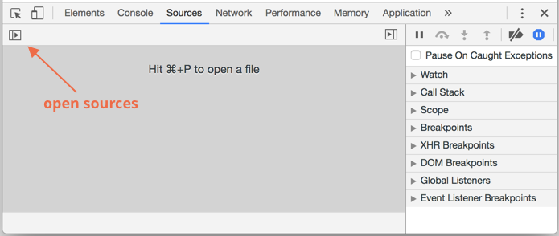
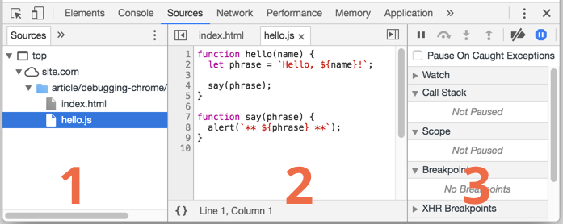
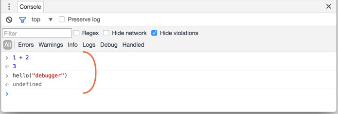
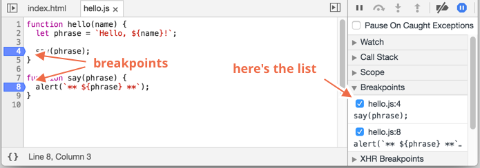
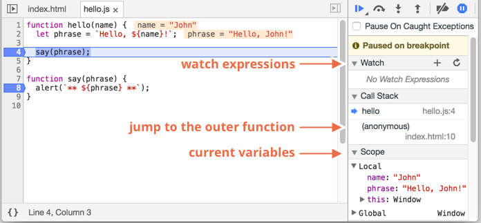

# Chrome でのデバッグ

より複雑なコードを書く前に、デバッグについて話しましょう。

すべてのモダンブラウザや、その他多くの環境は "デバッグ" をサポートしています。 -- 開発者ツールを使うことで、エラーの発見と修正がはるかに簡単になります。

ここでは、恐らくこの観点では最も機能が充実している Chrome を使います。

<<<<<<< HEAD
[cut]

## "sources" ペイン 
=======
## The "sources" pane
>>>>>>> a0266c574c0ab8a0834dd38ed65e7e4ee27f9cdb

Chromeのバージョンによっては少し違って見えるかもしれませんが、そこが何かは明白でしょう。

- Chromeの [example page](debugging/index.html) を開きます。
- `key:F12` (Mac: `key:Cmd+Opt+I`) で開発者ツールをONにします。
- `source` ペインを選択します。

もしもこの画面を見るのが初めてであれば、見ておくべきものがあります:



<<<<<<< HEAD
トグルボタン <span class="devtools" style="background-position:-168px -76px"></span> はファイルを表示するタブを開きます。
それをクリックして、`index.html` 、次にツリービューの `hello.js` を選択しましょう。ここで表示される内容は次の通りです:
=======
The toggler button <span class="devtools" style="background-position:-168px -76px"></span> opens the tab with files.

Let's click it and select `hello.js` in the tree view. Here's what should show up:
>>>>>>> a0266c574c0ab8a0834dd38ed65e7e4ee27f9cdb



ここでは3つの領域が確認できます:

<<<<<<< HEAD
1. **リソース領域** html, JavaScript, css や、ページに紐付いているイメージなどを含むファイルがリストされます。
2. **ソース領域** ソースコードを表示します。
3. **情報と制御領域** これはデバッグのためで、この後見ていきます。
=======
1. The **Resources zone** lists HTML, JavaScript, CSS and other files, including images that are attached to the page. Chrome extensions may appear here too.
2. The **Source zone** shows the source code.
3. The **Information and control zone** is for debugging, we'll explore it soon.
>>>>>>> a0266c574c0ab8a0834dd38ed65e7e4ee27f9cdb

同じトグル <span class="devtools" style="background-position:-200px -76px"></span> を再びクリックすること、リソースの一覧やコードを隠すことができます。

## コンソール 

<<<<<<< HEAD
`Esc` を押すとコンソールが下に表示されます。そこでコマンドを入力し、`key:Enter` をするとコマンドを実行することができます。
=======
If we press `key:Esc`, then a console opens below. We can type commands there and press `key:Enter` to execute.
>>>>>>> a0266c574c0ab8a0834dd38ed65e7e4ee27f9cdb

実行結果は下に表示されます。

例えば、ここでは `1+2 ` は `3` になり、`hello("debugger")` は何も返さないので、結果は `undefined` です:



## ブレイクポイント 

<<<<<<< HEAD
[example page](debugging/index.html) のコードの中で何が起こっているのか見てみましょう。`hello.js` で、行番号 `4` をクリックします。コードではなく、右にある `"4"` の数字です。
=======
Let's examine what's going on within the code of the [example page](debugging/index.html). In `hello.js`, click at line number `4`. Yes, right on the `4` digit, not on the code.
>>>>>>> a0266c574c0ab8a0834dd38ed65e7e4ee27f9cdb

これでブレイクポイントがセットできました。行 `8` の数字もクリックしましょう。

このようになるはずです(青はあなたがクリックした場所です):



*ブレイクポイント* はデバッガが自動でJavaScriptの実行を停止するコードのポイントです。

コードが停止している間、現在の変数を検査したり、コンソールでコマンドを実行することができます。つまり、そこでデバッグができます。

右のペインでは、常にブレイクポイントの一覧を見ることができます。色々なファイルで多くのブレイクポイントを持っているときに役に立ちます。それらは次のようなことができます:

<<<<<<< HEAD
- コード中のブレイクポイントに素早く移動する(右ペインで移動したいブレイクポイントをクリック)
- チェックを外すことで、一時的にブレイクポイントを無効にする
- 右クリックから削除を選択することで、ブレイクポイントを削除する
- ...など
=======
We can always find a list of breakpoints in the right pane. That's useful when we have many breakpoints in various files. It allows us to:
- Quickly jump to the breakpoint in the code (by clicking on it in the right pane).
- Temporarily disable the breakpoint by unchecking it.
- Remove the breakpoint by right-clicking and selecting Remove.
- ...And so on.
>>>>>>> a0266c574c0ab8a0834dd38ed65e7e4ee27f9cdb

```smart header="条件付きのブレイクポイント"
行番号の *右クリック* で *条件付きの* ブレイクポイントを作ることができます。与えられた式が真の場合にのみトリガします。

これは特定の変数値、もしくは関数パラメータに対してのみ停止する必要がある場合に便利です。
```

## デバッガコマンド 

次のように、`debugger` コマンドを使うことでもコードを停止することができます:

```js
function hello(name) {
  let phrase = `Hello, ${name}!`;

*!*
  debugger;  // <-- デバッガはここで止まります
*/!*

  say(phrase);
}
```

これは、コードエディタで作業中、ブラウザに切り替えて開発者ツールを起動し、該当のスクリプトを開いてブレイクポイントをセットするというが手間な場合に便利です。

## 一時停止して見回す 

今回の例では、`hello()` はページ読み込み中に呼び出されるので、デバッガを起動する最も簡単な方法はページを再読込することです。なので、 `key:F5` (Windows, Linux)または `key:Cmd+R` (Mac) を押しましょう。

ブレイクポイントがセットされているので、実行は4行目で一時停止します。:



右側にある情報のドロップダウンを開いてください(矢印のラベルがついています)。現在のコードの状態を調べることができます:

1. **`Watch` -- 任意の式の現在の値を表示します。**

    `+` をクリックし、式を入力することができます。デバッガは、常にその値を表示し、実行中に自動的に再計算を行います。

2. **`Call Stack` -- ネストされた呼び出しのチェーンを表示します。**

    現時点では、デバッガは `hello()` 呼び出しの内側におり、`index.html` のスクリプト(そこに関数はないので、 "anonymous" と呼ばれます)によって呼び出されました。

    スタックの項目をクリックすると、デバッガは該当のコードにジャンプし、すべての変数も同様に調べられます。

3. **`Scope` -- 現在の変数。**

    `Local` はローカル関数の変数を表示します。また、ソース上でもハイライト表示されたそれらの値を見ることができます。

    `Global` はグローバル変数を持っています

    そこには我々がまだ学んでいない `this` キーワードもあります、がもうすぐ学びます。

## 実行を追跡する 

スクリプトを *追跡* してみましょう。

右ペインの上部にそのボタンがあります。

<<<<<<< HEAD
<span class="devtools" style="background-position:-7px -76px"></span> -- 実行の継続, ホットキー `key:F8`.
: 実行を再開します。もしも他にブレイクポイントがなければ、そのまま実行が継続され、デバッガの制御から外れます。
=======
<span class="devtools" style="background-position:-7px -76px"></span> -- continue the execution, hotkey `key:F8`.
: Resumes the execution. If there are no additional breakpoints, then the execution just continues and the debugger loses control.
>>>>>>> a0266c574c0ab8a0834dd38ed65e7e4ee27f9cdb

    次の図は、それを行った後に見える画面です:

    

    実行は再開され、`say()` の中の別のブレイクポイントに到達し、そこで一時停止します。右の "Call stack" を見てください。もう一度呼び出すことで増えています。私たちは、今 `say()` の中にいます。

<span class="devtools" style="background-position:-137px -76px"></span> -- 一歩を踏み出します (次のコマンドを実行します)が、*関数の中には入りません*, ホットキー `key:F10`。
: 今クリックすると、 `alert`が表示されます。 重要なのは、 `alert` だけでなくどの関数に対しても可能であり、実行は関数の内部に入らずに実行するということです。

<span class="devtools" style="background-position:-72px -76px"></span> -- 一歩を踏み出します, ホットキー `key:F11`.
: 上と同じですが、ネストされた関数に "ステップイン" します。これをクリックすると、全てのスクリプトが1つずつ実行されます。

<span class="devtools" style="background-position:-104px -76px"></span> -- 現在の関数の最後まで実行を継続します、ホットキー `key:Shift+F11`。
: 実行は現在の関数の最後の行で停止します。これは <span class="devtools" style="background-position:-72px -76px"></span>を使ってネストされた呼び出しに誤って入ってしまい、早く関数の終わりまで進めたい場合に便利です。

<span class="devtools" style="background-position:-7px -28px"></span> -- すべてのブレイクポイントの有効/無効
: このボタンは単にブレイクポイントの on/off を切り替えるもので、実行の状態は変わりません。

<span class="devtools" style="background-position:-264px -4px"></span> -- エラー発生時の自動一時停止の有効/無効
: 有効にして開発者ツールを開いている場合、スクリプトエラーが起きると実行が自動で一時停止します。そして、何が間違っていたかを知るために変数を分析することができます。なので、スクリプトがエラーで死んだ場合は、どこで死んでその時どんなコンテキストであるかを確認するため、デバッガを起動しこのオプションを有効にしてページを再読込しましょう。

```smart header="Continue to here"
コードの行で右クリックすると、"Continue to here" と呼ばれる素晴らしい選択肢を持つコンテキストメニューが開きます。

これは複数のステップを進めたいが、ブレイクポイントをセットするのが面倒なときに便利です。
```

## ロギング 

コンソールに何かを出力するために `console.log` 関数があります。

例えば、これはコンソールに `0` から `4` までの値を出力します:

```js run
// 見るにはコンソールを開いてください
for (let i = 0; i < 5; i++) {
  console.log("value", i);
}
```

コンソールの中なので、通常のユーザはその出力を見ることはありません。見るためには、開発者ツールのコンソールタブを開くか、開発者ツールの別のタブで `key:Esc` を押します。 :下にコンソールが表示されます。

コードに十分なログを仕込んでいれば、デバッガなしで何が行われているか知ることができます。

## サマリ 

<<<<<<< HEAD
これまで見てきた通り、スクリプトを一時停止するには主に3つの方法があります。
1. ブレイクポイント
2. `debugger` 構文
3. エラー (開発者ツールを開き、ボタン <span class="devtools" style="background-position:-264px -4px"></span> を ON にしている場合)
=======
As we can see, there are three main ways to pause a script:
1. A breakpoint.
2. The `debugger` statements.
3. An error (if dev tools are open and the button <span class="devtools" style="background-position:-264px -4px"></span> is "on").
>>>>>>> a0266c574c0ab8a0834dd38ed65e7e4ee27f9cdb

これらにより変数を検査し実行が間違っている場所を確認することができます。

<<<<<<< HEAD
ここで説明した以上に、開発者ツールには多くのオプションがあります。完全なマニュアルは <https://developers.google.com/web/tools/chrome-devtools>です。
=======
There are many more options in developer tools than covered here. The full manual is at <https://developers.google.com/web/tools/chrome-devtools>.
>>>>>>> a0266c574c0ab8a0834dd38ed65e7e4ee27f9cdb

このチャプターの情報はデバッグを始めるには十分ですが、今後、特にブラウザの作業が多い場合は、上記のサイトを見て開発者ツールのより高度な機能を調べてください。

また、開発者ツールの色んな場所をクリックすることで何が表示されるかを見ることが出来ます。恐らくそれは開発者ツールを学ぶのに最も近道です。同様に右クリックも忘れないように!
