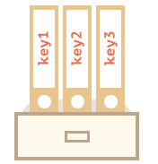
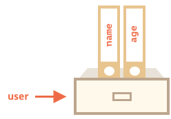
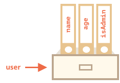
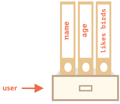
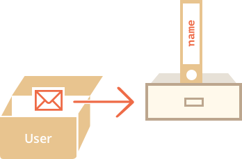

# オブジェクト

<<<<<<< HEAD
チャプター <info:types> でご存知の通り、JavaScriptには７つの言語の型があります。そのうち６つは "プリミティブ" と呼ばれています。なぜなら、それらの値は１つのものだけを含むためです(文字列、数値、もしくはどんな値にでもなります)。
=======
As we know from the chapter <info:types>, there are seven data types in JavaScript. Six of them are called "primitive", because their values contain only a single thing (be it a string or a number or whatever).
>>>>>>> 30f1dc4e4ed9e93b891abd73f27da0a47c5bf613

一方で、オブジェクトは様々なデータとより複雑なエンティティのキー付けされたコレクションを保持するために使われます。JavaScriptでは、オブジェクトは言語のほぼすべての側面に入り込みます。なので、どこに行くよりもまず最初にそれらを理解する必要があります。

<<<<<<< HEAD
[cut]

オブジェクトは波括弧 `{…}`と任意の *プロパティ* のリストで作られます。プロパティは "key:value" のペアで、`key` は文字列(もしくは"プロパティ名"と呼ばれます)で、`value` は何でも構いません。

オブジェクトは、署名されたファイルを持つキャビネットとしてイメージすることができます。すべてのデータは、キーによってそのファイルの中に格納されます。ファイルを名前で検索したり、ファイルの追加や削除は簡単です。
=======
An object can be created with figure brackets `{…}` with an optional list of *properties*. A property is a "key: value" pair, where `key` is a string (also called a "property name"), and `value` can be anything.

We can imagine an object as a cabinet with signed files. Every piece of data is stored in its file by the key. It's easy to find a file by its name or add/remove a file.
>>>>>>> 30f1dc4e4ed9e93b891abd73f27da0a47c5bf613



空のオブジェクト("空のキャビネット")は2つ構文のうちどちらかで作ることができます:

```js
let user = new Object(); // "オブジェクトコンストラクタ" 構文
let user = {};  // "オブジェクトリテラル" 構文
```


通常、波括弧 `{...}` が使われます。その宣言は *オブジェクトリテラル* と呼ばれます。

## リテラルとプロパティ 

プロパティを "key: value" のペアとして `{...}` の中に置くことが出来ます。

```js
let user = {     // オブジェクト
  name: "John",  // キー "name" に値 "John" が格納される
  age: 30        // キー "age" に値 30 が格納される
};
```

プロパティはコロン `":"` の前がキー("名前" もしくは "識別子" として知られています)で、その右が値です。

`user` オブジェクトには2つのプロパティがあります:

1. 最初のプロパティは名前 `"name"` とその値 `"John"` を持っています。
2. 2つ目は、名前 `"age"` とその値 `30` です。

生成された `user` オブジェクトは、"name" と "age" とラベル付けされた2つのファイルを持つキャビネットとしてイメージできます。



私たちは、いつでもそこからファイルの追加、削除、参照ができます。

プロパティ値へはドット表記を使いアクセスすることができます。:

```js
// オブジェクトのフィールドを取得:
alert( user.name ); // John
alert( user.age ); // 30
```

値はどんな型にもなります。boolean の値を追加してみましょう:

```js
user.isAdmin = true;
```



プロパティを削除するためには、`delete` 演算子を使います:

```js
delete user.age;
```


また、複数語のプロパティ名を使うこともできますが、この場合は引用符で囲む必要があります:

```js
let user = {
  name: "John",
  age: 30,
  "likes birds": true  // 複数語のプロパティ名は引用符で囲まなければなりません
};
```




<<<<<<< HEAD
````smart header="末尾のカンマ"
このリストの最後のプロパティはカンマで終わることがあります:
=======
The last property in the list may end with a comma:
>>>>>>> 30f1dc4e4ed9e93b891abd73f27da0a47c5bf613
```js
let user = {
  name: "John",
  age: 30*!*,*/!*
}
```
<<<<<<< HEAD
これは、「末尾」または「ぶら下がり」のコンマと呼ばれます。 すべての行が同じ表記になるため、プロパティの追加/削除/移動が簡単になります。
````
=======
That is called a "trailing" or "hanging" comma. Makes it easier to add/remove/move around properties, because all lines become alike.
>>>>>>> 30f1dc4e4ed9e93b891abd73f27da0a47c5bf613

## 角括弧 

複数語のプロパティでは、ドットアクセスが動作しません:

```js run
// これは構文エラーになります
user.likes birds = true
```

これは、ドットは有効な変数識別子であることをキーに要求するためです。

代わりに任意の文字列で動作する "角括弧表記" があります:


```js run
let user = {};

// set
user["likes birds"] = true;

// get
alert(user["likes birds"]); // true

// delete
delete user["likes birds"];
```

今やすべて問題ありません。括弧内の文字列は適切に引用符がつけられている(どのようなタイプの引用符でも動作します)ことに留意してください。

角括弧は、任意の式の結果としてプロパティ名を取得する方法も提供します -- リテラル文字列とは逆に -- 次のようなイメージです:

```js
let key = "likes birds";

// user["likes birds"] = true; と同じ
user[key] = true;
```

ここで、変数 `key` は実行時に計算されるかもしれないし、ユーザの入力に依存するかもしれません。そして、プロパティにアクセスするときにそれを使います。これは素晴らしい柔軟性をもたらします。ドッド表記の場合、同じようにはできません。

例:

```js run
let user = {
  name: "John",
  age: 30
};

let key = prompt("What do you want to know about the user?", "name");

// 変数でアクセス
alert( user[key] ); // John ("name" が入力された場合)
```


### 算出プロパティ

オブジェクトリテラルでは、角括弧を使うことが出来ます。それは *算出プロパティ* と呼ばれます。

例:

```js run
let fruit = prompt("Which fruit to buy?", "apple");

let bag = {
*!*
  [fruit]: 5, // プロパティ名は変数 fruit から取られます
*/!*
};

alert( bag.apple ); // 5 fruit="apple" の場合
```

算出プロパティの意味はシンプルです: `[fruit]` はプロパティ名は変数 `fruit` の値になることを意味します。

なので、もし訪問者が `"apple"` を入力すると, `bag` は `{apple: 5}` になります。

基本的には、次と同じように動作します。
```js run
let fruit = prompt("Which fruit to buy?", "apple");
let bag = {};

// fruit 変数からプロパティ名を取る
bag[fruit] = 5;
```

角括弧の中では、より複雑な式を使うことができます。

```js
let fruit = 'apple';
let bag = {
  [fruit + 'Computers']: 5 // bag.appleComputers = 5
};
```

角括弧はドット表記よりもはるかに強力です。それらは任意のプロパティ名や変数を許容します。しかし、書くのはドットより面倒です。

なので、プロパティ名を知っていて単純な場合であれば、ドットが使われます。そして、もしより複雑な何かが必要なとき、角括弧に切り替えます。


````smart header="予約語はプロパティ名として使用可能です"
変数は "for", "let", "return" などのような 予約語と同じものをもつことはできません。

しかし、オブジェクトプロパティではこのような制限はありません。どんな名前でも大丈夫です:

```js run
let obj = {
  for: 1,
  let: 2,
  return: 3
};

alert( obj.for + obj.let + obj.return );  // 6
```

基本的に、任意の名前が使用可能ですが、特別なものが1つあります: `"__proto__"` は歴史的な理由から特別な扱いを受けています。例えば、非オブジェクトにそれをセットすることは出来ません。:

```js run
let obj = {};
obj.__proto__ = 5;
alert(obj.__proto__); // [object Object], 期待通りには動作しません。
```

コードから分かるように、プリミティブ `5` への代入は無視されます。

<<<<<<< HEAD
もし、オブジェクトに任意の key-value のペアを保持し、訪問者がキーを指定できるようにしたとき、それはバグや脆弱性の元になる可能性があります。
=======
That can become a source of bugs and even vulnerabilities if we intend to store arbitrary key-value pairs in an object, and allow a visitor to specify the keys.
>>>>>>> 30f1dc4e4ed9e93b891abd73f27da0a47c5bf613

そのケースで訪問者は、キーとして "`__proto__`" を選ぶかもしれません。すると代入のロジックは崩壊するでしょう(上にあるように)。

<<<<<<< HEAD
オブジェクトが、`__proto__` を通常のプロパティとして扱うようにするための方法があります。それは後で説明しますが、まずはそれを理解するためにオブジェクトについてより知る必要があります。
別のデータ構造 [Map](info:map-set-weakmap-weakset) があり、それはチャプター <info:map-set-weakmap-weakset> で学びます。それもまた任意のキーをサポートします。
=======
There is a way to make objects treat `__proto__` as a regular property, which we'll cover later, but first we need to know more about objects.
There's also another data structure [Map](info:map-set-weakmap-weakset), that we'll learn in the chapter <info:map-set-weakmap-weakset>, which supports arbitrary keys.
>>>>>>> 30f1dc4e4ed9e93b891abd73f27da0a47c5bf613
````

## プロパティの短縮構文 

実際のコードでは、既存の変数をプロパティ名の値として使用することがよくあります。

例えば:

```js run
function makeUser(name, age) {
  return {
    name: name,
    age: age
    // ...他のプロパティ
  };
}

let user = makeUser("John", 30);
alert(user.name); // John
```

上の例では、プロパティは変数と同じ名前を持っています。変数からプロパティを作るユースケースでは、非常に一般的です。そして、それを短く書くための特別な *プロパティの短縮構文* があります。

`name:name` の代わりに、このように単に `name` と書くことができます:

```js
function makeUser(name, age) {
*!*
  return {
    name, // name: name と同じ
    age   // age: age と同じ
    // ...
  };
*/!*
}
```

同じオブジェクトで、通常のプロパティと短縮構文両方を使うことができます:

```js
let user = {
  name,  // name:name と同じ
  age: 30
};
```

## 存在チェック 

注目すべきオブジェクトの機能は、どんなプロパティへもアクセスできることです。もしプロパティが存在しない場合でもエラーにはなりません! 存在しないプロパティへのアクセスは、単に `undefined` を返します。これはプロパティが存在するかどうかを確認する非常に一般的な方法です -- その値を取得し、 undefined と比較します。:

```js run
let user = {};

alert( user.noSuchProperty === undefined ); // true は "そのようなプロパティはありません" を意味する
```

プロパティの存在チェックのための特別な演算子 `"in"` もあります。

構文は次の通りです:
```js
"key" in object
```

例:

```js run
let user = { name: "John", age: 30 };

alert( "age" in user ); // true, user.age は存在する
alert( "blabla" in user ); // false, user.blabla は存在しない
```

`in` の左側は *プロパティ名* である必要があることに注意してください。それは通常引用符で囲まれた文字列です。

<<<<<<< HEAD
もし引用符を除いた場合、テストされる実際のプロパティ名を持つ変数であることを意味します。例えば:
=======
If we omit quotes, that would mean a variable containing the actual name will be tested. For instance:
>>>>>>> 30f1dc4e4ed9e93b891abd73f27da0a47c5bf613

```js run
let user = { age: 30 };

let key = "age";
alert( *!*key*/!* in user ); // true, キーから名前を取り、そのプロパティをチェック
```

````smart header="`undefined` を格納しているプロパティに \"in\" を使う"
通常、厳密等価演算子 `"=== undefined"` チェックは正しく動作します。しかし、それが失敗する特別なケースがあります。 `"in"` は正しく動作します。

それは、オブジェクトのプロパティは存在するが、`undefined` が格納されているときです:

```js run
let obj = {
  test: undefined
};

alert( obj.test ); // これは undefined, なので - このようなプロパティはなし?

alert( "test" in obj ); // true, プロパティは存在します!
```


上のコードでは、プロパティ `obj.test` は技術的には存在します。なので、 `in` 演算子は正しく動いています。

このようなシチュエーションは非常にまれです。なぜなら `undefined` は通常代入されないからです。殆どの場合、"不明" または "空" の値として `null` を使います。
````


## "for..in" ループ 

オブジェクトのすべてのキーを見て回るための、ループの特別な形があります: `for..in` です。これは以前学んだ `for(;;)` 構造と完全に異なるものです。

構文:

```js
<<<<<<< HEAD
for(key in object) {
  // オブジェクトプロパティの各キーに対して本体を実行
=======
for (key in object) {
  // executes the body for each key among object properties
>>>>>>> 30f1dc4e4ed9e93b891abd73f27da0a47c5bf613
}
```

例えば、`user` のすべてのプロパティを出力してみましょう:

```js run
let user = {
  name: "John",
  age: 30,
  isAdmin: true
};

for (let key in user) {
  // keys
  alert( key );  // name, age, isAdmin
  // values for the keys
  alert( user[key] ); // John, 30, true
}
```

すべての "for" 構造は、ここでの `let key`  のように、ループ内でループする変数を宣言することに留意してください。

<<<<<<< HEAD
また、ここでの `key` の代わりに、別の変数名を使うこともできます。例えば、`"for(let prop in obj)"` もまた広く使われています。
=======
Also, we could use another variable name here instead of `key`. For instance, `"for (let prop in obj)"` is also widely used.
>>>>>>> 30f1dc4e4ed9e93b891abd73f27da0a47c5bf613


### オブジェクトの順序付け

<<<<<<< HEAD
オブジェクトは順序付けられますか？つまり、オブジェクトをループするとき、追加したのと同じ順序ですべてのプロパティを取得しますか？それを保証することができますか？
=======
Are objects ordered? In other words, if we loop over an object, do we get all properties in the same order they were added? Can we rely on this?
>>>>>>> 30f1dc4e4ed9e93b891abd73f27da0a47c5bf613

短い回答は: "特別な方法で順序付けられます": 整数値のプロパティはソートされます、それ以外は作成した順になります。以下、詳細です。

例として、電話のコードをもつオブジェクトを考えてみましょう:

```js run
let codes = {
  "49": "Germany",
  "41": "Switzerland",
  "44": "Great Britain",
  // ..,
  "1": "USA"
};

*!*
for (let code in codes) {
  alert(code); // 1, 41, 44, 49
}
*/!*
```

オブジェクトはユーザに対してオプションの一覧を提案をするのに使われるかもしれません。もし主にドイツのユーザをターゲットにしたサイトを作る場合、恐らく最初に `49` が出て欲しいです。

しかし、コードを実行すると完全に異なったものが見えます:

- USA (1) が最初に来ます
- 次に Switzerland (41) などが並びます.

電話コードは昇順にソートされて表示されます。なぜなら、それらが整数だからです。なので、`1, 41, 44, 49` と見えます。

````smart header="整数プロパティとは?"
ここで "整数プロパティ" という用語は、変更なしで整数に変換できる文字列を意味します。

したがって、"49" は整数のプロパティ名です。なぜなら、整数の数に変換されて戻っても、それは変わらないからです。 しかし、 "+49"と "1.2"はそうではありません:

```js run
<<<<<<< HEAD
// Math.trunc は小数部を取り除く組み込み関数
alert( String(Math.trunc(Number("49"))) ); // "49", 同じ, 整数プロパティ
alert( String(Math.trunc(Number("+49"))) ); // "49", 同じではない ⇒ 非整数プロパティ
alert( String(Math.trunc(Number("1.2"))) ); // "1", 同じではない ⇒ 非整数プロパティ
=======
// Math.trunc is a built-in function that removes the decimal part
alert( String(Math.trunc(Number("49"))) ); // "49", same, integer property
alert( String(Math.trunc(Number("+49"))) ); // "49", not same "+49" ⇒ not integer property
alert( String(Math.trunc(Number("1.2"))) ); // "1", not same "1.2" ⇒ not integer property
>>>>>>> 30f1dc4e4ed9e93b891abd73f27da0a47c5bf613
```
````

...一方、もしキーが整数でない場合、作られた順でリストされます。例です:

```js run
let user = {
  name: "John",
  surname: "Smith"
};
user.age = 25; // 1つ追加

*!*
// 非整数プロパティは作成順にリストされます
*/!*
for (let prop in user) {
  alert( prop ); // name, surname, age
}
```

従って、電話コードの問題を直すためには、整数でないコードを作ることで対応することができます。 各コードの前にプラス `"+"` 記号をつければ十分です。

このように:

```js run
let codes = {
  "+49": "Germany",
  "+41": "Switzerland",
  "+44": "Great Britain",
  // ..,
  "+1": "USA"
};

for (let code in codes) {
  alert( +code ); // 49, 41, 44, 1
}
```

これで意図した通りに動作します。

## 参照をコピーする 

オブジェクトとプリミティブの基本的な違いの１つは、オブジェクトは "参照によって" 格納、コピーされることです。

プリミティブな値: 文字列、数値、真偽値 -- は "値として" 代入/コピーされます。

例:

```js
let message = "Hello!";
let phrase = message;
```

上記は、結果として2つの独立した変数をもち、それぞれ文字列 `"Hello!"` を保持しています。


オブジェクトはそうではありません。

<<<<<<< HEAD
**変数はオブジェクト自体ではなく、その "メモリ内のアドレス"、つまりそれへの "参照" を格納します。**
=======
**A variable stores not the object itself, but its "address in memory", in other words "a reference" to it.**
>>>>>>> 30f1dc4e4ed9e93b891abd73f27da0a47c5bf613

オブジェクトの絵はこうなります:

```js
let user = {
  name: "John"
};
```



ここで、オブジェクトはメモリ上のどこかへ格納されています。そして変数 `user` はその "参照" を持っています。

**オブジェクト変数がコピーされるとき、 -- 参照がコピーされます、オブジェクトは複製されません。**

もしオブジェクトをキャビネットとしてイメージするとしたら、変数はそれへの鍵です。変数のコピーは鍵の複製であり、キャビネット自身ではありません。

例:

```js no-beautify
let user = { name: "John" };

let admin = user; // 参照のコピー
```

今、私たちは2つの変数を持っており、それぞれ同じオブジェクトへの参照を持っています。:


私たちは任意の変数を使って、キャビネットにアクセスしその中身を変更することができます:

```js run
let user = { name: 'John' };

let admin = user;

*!*
admin.name = 'Pete'; // "admin" 参照によって変更される
*/!*

alert(*!*user.name*/!*); // 'Pete', 変更は "user" 参照から見えます
```

<<<<<<< HEAD
上の例は1つのオブジェクトしかないことのデモです。私たちがキャビネットと2つの鍵を持っていて、それらの1つ(`admin`)を使ってその中のものを取得し変更します。その後、別の鍵(`user`)を使ったときには、先ほど変更した結果が見えます。
=======
The example above demonstrates that there is only one object. As if we had a cabinet with two keys and used one of them (`admin`) to get into it. Then, if we later use the other key (`user`) we would see changes.
>>>>>>> 30f1dc4e4ed9e93b891abd73f27da0a47c5bf613

### 参照による比較

オブジェクトの等価 `==` と厳密等価　`===` 演算子は、全く同じように動作します。

**2つのオブジェクトは、同じオブジェクトのときだけ等しくなります。**

例えば、2つの変数が同じオブジェクトを参照しているとき、それらは等しいです:

```js run
let a = {};
let b = a; // 参照のコピー

alert( a == b ); // true, 両方の変数は同じオブジェクトを参照しています
alert( a === b ); // true
```

また、2つの独立したオブジェクトは等しくありません。たとえそれらが空だとしても:

```js run
let a = {};
let b = {}; // 2つの独立したオブジェクト

alert( a == b ); // false
```

<<<<<<< HEAD
`obj1 > obj2` のような比較、もしくは反対にプリミティブ `obj == 5` のような比較では、オブジェクトはプリミティブに変換されます。私たちはオブジェクト変換がどのように動作するかこの後すぐに学ぶでしょう。しかし真実を言うと、このような比較はほとんど必要とされず、通常はコードの誤りです。
=======
For comparisons like `obj1 > obj2` or for a comparison against a primitive `obj == 5`, objects are converted to primitives. We'll study how object conversions work very soon, but to tell the truth, such comparisons are necessary very rarely and usually are a result of a coding mistake.
>>>>>>> 30f1dc4e4ed9e93b891abd73f27da0a47c5bf613

### Const オブジェクト

`const` として宣言されたオブジェクトは変更 *できます* 。

例:

```js run
const user = {
  name: "John"
};

*!*
user.age = 25; // (*)
*/!*

alert(user.age); // 25
```

行 `(*)` はエラーを起こすように見えるかもしれませんが、それらは全く問題ありません。`const` は `user` 自身の値を固定するからです。そしてここで `user` は常に同じオブジェクトへの参照を保持します。行　`(*)` はオブジェクトの *内側* へ行っており、`user` の再代入ではありません。

`const` は、もし `user` に他の何かをセットしようとしたときにエラーになります。例えば:

```js run
const user = {
  name: "John"
};

*!*
// エラー (user の再代入ができない)
*/!*
user = {
  name: "Pete"
};
```

...しかし、もしオブジェクトのプロパティを定数にしたい場合はどうすればいいでしょう？ `user.age = 25` がエラーになるように。そうすることも可能です。 これについては、チャプター <info:property-descriptors> で説明します。

## クローンとマージ, Object.assign 

これまでの通り、オブジェクト変数のコピーは、同じオブジェクトへの参照をもう1つ作ります。

しかし、もしオブジェクトの複製が必要な場合はどうしましょう？独立したコピー、クローンを作るには？

それは可能ですが、JavaScriptには組み込みのメソッドがないので、少し難しいです。実際、それはめったに必要ありません。参照によるコピーはたいていの場合で問題ありません。

しかし、もし本当にそうしたい場合は、新しいオブジェクトを作り、プリミティブなレベルでそのプロパティを繰り返しコピーしていくことで、既存のものの構造を複製する必要があります。

このようになります:

```js run
let user = {
  name: "John",
  age: 30
};

*!*
let clone = {}; // 新しいからオブジェクト

// すべての user プロパティをその中にコピーしましょう
for (let key in user) {
  clone[key] = user[key];
}
*/!*

<<<<<<< HEAD
// 今、clone は完全に独立したクローンです
clone.name = "Pete"; // その中のデータを変更
=======
// now clone is a fully independent clone
clone.name = "Pete"; // changed the data in it
>>>>>>> 30f1dc4e4ed9e93b891abd73f27da0a47c5bf613

alert( user.name ); // 依然としてオリジナルのオブジェクトは John
```

また、そのために、[Object.assign](mdn:js/Object/assign) 関数を使うことができます。

構文はこうです:

```js
Object.assign(dest, [src1, src2, src3...])
```

- 引数 `dest`, そして `src1, ..., srcN` (必要なだけ) はオブジェクトです。
- すべてのオブジェクト `src1, ..., srcN` のプロパティを `dest` にコピーします。言い換えると、2つ目から始まる全ての引数のプロパティは、最初の引数のオブジェクトにコピーされます。そして `dest` を返します。

例えば、いくつかのオブジェクトを1つにマージするために使います:
```js
let user = { name: "John" };

let permissions1 = { canView: true };
let permissions2 = { canEdit: true };

*!*
// permissions1 and permissions2 のすべてのプロパティを user にコピー
Object.assign(user, permissions1, permissions2);
*/!*

// now user = { name: "John", canView: true, canEdit: true }
```

もし、受け取ったオブジェクト (`user`) が既に同じプロパティ名のものをもっていたら、上書きします:

```js
let user = { name: "John" };

// name を上書き, isAdmin を追加
Object.assign(user, { name: "Pete", isAdmin: true });

// now user = { name: "Pete", isAdmin: true }
```

また、シンプルなクローンのためのループを置き換えるために、`Object.assign` を使うこともできます。

```js
let user = {
  name: "John",
  age: 30
};

*!*
let clone = Object.assign({}, user);
*/!*
```

これは `user` のすべてのプロパティを空のオブジェクトにコピーし、返します。ループの場合と同じことをしますが、より短い記載になります。

今まで、`user` のすべてのプロパティがプリミティブであると仮定していましたが、プロパティは他のオブジェクトの参照になることもあります。それらはどうなるでしょう？

このような:
```js run
let user = {
  name: "John",
  sizes: {
    height: 182,
    width: 50
  }
};

alert( user.sizes.height ); // 182
```

今、`user.sizes` はオブジェクトであり、参照によるコピーがされるため、`clone.sizes = user.sizes` というコピーでは不十分です。なので、`clone` と `user` は同じ sizes を共有します:

このようになります:
```js run
let user = {
  name: "John",
  sizes: {
    height: 182,
    width: 50
  }
};

let clone = Object.assign({}, user);

alert( user.sizes === clone.sizes ); // true, 同じオブジェクト

// user と clone は sizes を共有します
user.sizes.width++;       // 一方からプロパティを変更します
alert(clone.sizes.width); // 51, 他方から変更した結果が見えます
```

<<<<<<< HEAD
これを修正するには、`user[key]` の各値を調べ、それがオブジェクトの場合はその構造も複製するクローンのループを使用する必要があります。 これは "ディープクローン(ディープコピー)" と呼ばれます。
=======
To fix that, we should use the cloning loop that examines each value of `user[key]` and, if it's an object, then replicate its structure as well. That is called a "deep cloning".

There's a standard algorithm for deep cloning that handles the case above and more complex cases, called the [Structured cloning algorithm](http://w3c.github.io/html/infrastructure.html#safe-passing-of-structured-data). In order not to reinvent the wheel, we can use a working implementation of it from the JavaScript library [lodash](https://lodash.com), the method is called [_.cloneDeep(obj)](https://lodash.com/docs#cloneDeep).
>>>>>>> 30f1dc4e4ed9e93b891abd73f27da0a47c5bf613

上記のケースやより複雑なケースを処理するディープクローン作成のための標準的なアルゴリズムがあります、それは[Structured cloning algorithm](https://w3c.github.io/html/infrastructure.html#internal-structured-cloning-algorithm) と呼ばれています。
車輪の再発明をしないために、JavaScript ライブラリ[lodash](https://lodash.com) にある処理を利用することができます。そのメソッドは [_.cloneDeep(obj)](https://lodash.com/docs#cloneDeep) と呼ばれています。


## サマリ 

オブジェクトはいくつかの特別な機能を持つ連想配列です。

それらはプロパティ(key-valueペア)を格納します:
- プロパティのキーは文字列またはシンボル(通常は文字列)です。
- 値は任意の型になります。

プロパティにアクセスするために、次のようにします:
- ドット表記: `obj.property`
- 角括弧表記: `obj["property"]`。角括弧は変数からキーを取ることもできます。`obj[varWithKey]` のように。

<<<<<<< HEAD
追加の演算子:
- プロパティを削除: `delete obj.prop`
- 与えられたキーを持つプロパティの存在チェック: `"key" in obj`
- オブジェクトのイテレート: `for(let key in obj)` ループ
=======
Additional operators:
- To delete a property: `delete obj.prop`.
- To check if a property with the given key exists: `"key" in obj`.
- To iterate over an object: `for (let key in obj)` loop.
>>>>>>> 30f1dc4e4ed9e93b891abd73f27da0a47c5bf613

オブジェクトは参照によって代入やコピーされます。つまり、変数は "オブジェクトの値" ではなく、 値への "参照" (メモリ上のアドレス)を格納します。従って、このような変数をコピーしたり、それを関数の引数として渡すと、オブジェクトではなく参照がコピーされます。 コピーされた参照（プロパティの追加/削除など）によるすべての操作は、同じ単一のオブジェクトに対して実行されます。

"本当のコピー" (クローン) をするために、`Object.assign` または [_.cloneDeep(obj)](https://lodash.com/docs#cloneDeep) を使うことができます。

この章で学んだのは、"普通のオブジェクト"、あるいは単に "オブジェクト" と呼ばれています。

JavaScriptには他にも多くの種類のオブジェクトがあります:

- 順序付けされたデータコレクションを格納する `Array`
- 日付と時刻に関する情報を格納する `Date`
- エラーに関する情報を格納する `Error`
- ...等々

後で勉強しますが、それらは特別な機能を持っています。また、それらは "Array型" もしくは "Data型" と言われることがありますが、形式的には自分の型ではなく、単一の「オブジェクト」データ型に属しています。 そして、それをさまざまな方法で拡張しています。

<<<<<<< HEAD
Javascript のオブジェクトはとても強力です。ここでは本当に巨大なトピックのほんの始まりを学びました。私たちは、この後に続くチャプターでオブジェクトをより深く見ていき、それらについてもっと学びます。
=======
Objects in JavaScript are very powerful. Here we've just scratched the surface of a topic that is really huge. We'll be closely working with objects and learning more about them in further parts of the tutorial.
>>>>>>> 30f1dc4e4ed9e93b891abd73f27da0a47c5bf613
